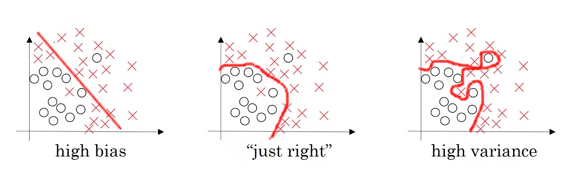
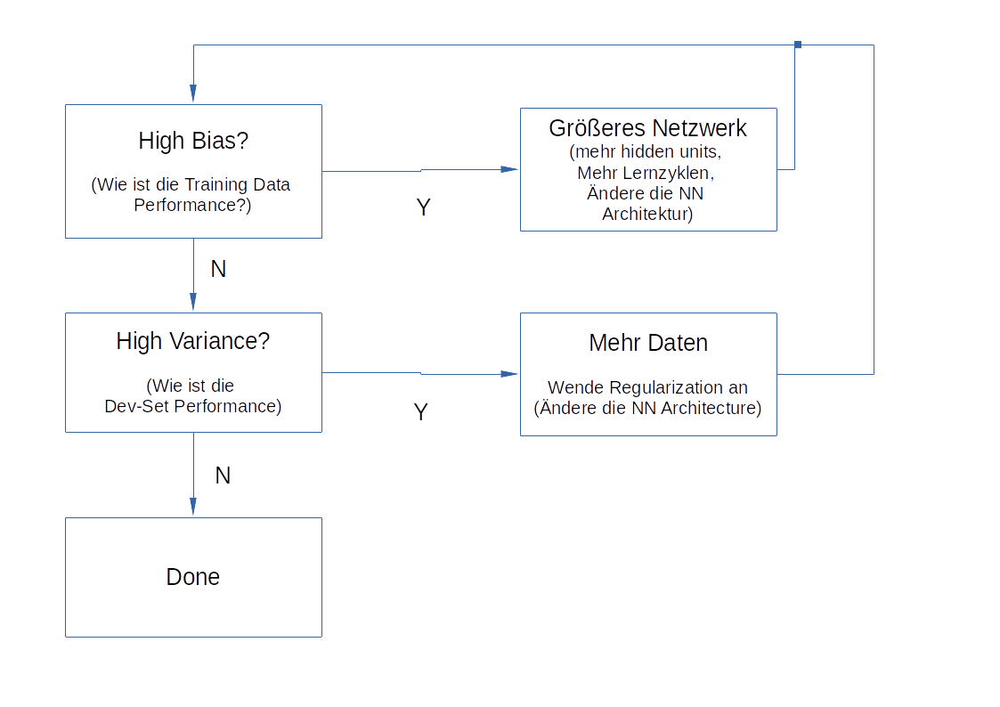

.. _dlanpassungen:

#################################
Deep Learning Modellanpassungen
#################################

Bias / Varianz
**************

**Trade off von Bias und Varianz**

"In statistics and machine learning, the bias–variance tradeoff is the property of a model that the variance of the
parameter estimates across samples can be reduced by increasing the bias in the estimated parameters.
The bias–variance dilemma or bias–variance problem is the conflict in trying to simultaneously minimize these two
sources of error that prevent supervised learning algorithms from generalizing beyond their training set:

* The bias error is an error from erroneous assumptions in the learning algorithm. High bias can cause an algorithm to miss the relevant relations between features and target outputs (underfitting).
* The variance is an error from sensitivity to small fluctuations in the training set. High variance can cause an algorithm to model the random noise in the training data, rather than the intended outputs (overfitting).

This trade-off is universal: It has been shown that a model that is asymptotically unbiased must have unbounded variance.
The bias–variance decomposition is a way of analyzing a learning algorithm's expected generalization error with respect to a particular problem as a sum of three terms, the bias, variance, and a quantity called the irreducible error, resulting from noise in the problem itself."
[ `Bias Variance TradeOff`_ ]

.. _Bias Variance TradeOff: https://en.wikipedia.org/wiki/Bias%E2%80%93variance_tradeoff

Beispiel:
*Quelle: Andrew Ng, Coursera, Improving Deep Learning*

.. _dl_01_Bias_Varianz:

    :numref:`Bias Varianz (Abb. %s)  <dl_01_Bias_Varianz>`

* links: Beispiel für ein hohes Bias. Hohe Fehlerrate bei den vorhergesagten Werten (Underfitting)
* rechts: Beispiel für eine hohe Varianz. Das Modell auf Basis der Trainingsdaten ist zu spezifisch, so dass das Modell
  schlecht an den realen Daten skalieren kann. (Overfitting)
* Mitte: optimaler Beziehung zw. Fehlern auf der einen Seite und Komplexität des Modells auf der anderen Seite.

Beispiel für die Beurteilung :sup:`*)`:

+------------------+------------------------------------------------------------------------+
|                  | **Fehlerrate**                                                         |
+------------------+-------------------+-----------------+-----------------+----------------+
|Test-Set          |     1%            |  15%            |  15%            |   0.5%         |
+------------------+-------------------+-----------------+-----------------+----------------+
|Development-Set   |     11%           |  16%            |  30%            |   1%           |
+------------------+-------------------+-----------------+-----------------+----------------+
|Beurteilung       |   overfitting,    |  underfitting,  |  high bias,     |   low bias,    |
|                  |   hohe Varianz    |  High Bias      |  high variance  |   low variance |
+------------------+-------------------+-----------------+-----------------+----------------+

:sup:`*)`: Alle Werte werden in Relation zu einer Fehlerrate beim Menschen beurteilt, in diesem Fall liegt dieser bei
annnährend 0% (auch Bayes Fehler genannt)

Zurück zu :ref:`dlanpassungen`

Basisprozess im Machinelearning
********************************

.. _dl_01_basis_ml_process:

    :numref:`Basis ML Prozess (Abb. %s)  <dl_01_basis_ml_process>`

Zurück zu :ref:`dlanpassungen`

Regularization
********************************
Über "Regularization" kann Einfluss auf Bias und Varianz genommen werden.

Regularization in Logistic Regression
======================================
Ziel is die Minimierung der Funktion J(w,b)

:math:`min(w,b) \rightarrow J(w,b)`

Man addiert die Regularization zur Funktion. Unterschieden wird zwischen L1 und L2 Regularization, L2 wird
typischerweise verwendet.

:math:`L_{2}` Regularization = :math:`\|w\|^{2}_{2}=\sum^{N_x}_{j=1}w^{2}_{j}=w^{T}w`

Daraus folgt für die zu minimierende Funktion:
:math:`J(w,b)=\frac{1}{m} \sum^{m}_{i=1}L(\hat y^{(i)}, y^{(i)})+ \frac{\lambda}{2m}\|w\|^{2}_{2}`

Der Vollständigkeit halber:
:math:`L_{1}` Regularization = :math:`\frac{\lambda}{2m}\sum^{N_x}_{i=1}|w|=\frac{\lambda}{2m}\|w\|_{1}`

w ist ein Vektor mit vielen Nullen, damit kann das Modell komprimiert werden (dies ist in der Praxis eher nachrangig)

:math:`\lambda=` ist ein Regularization Parameter und kann ebenfalls angepasst werden.

